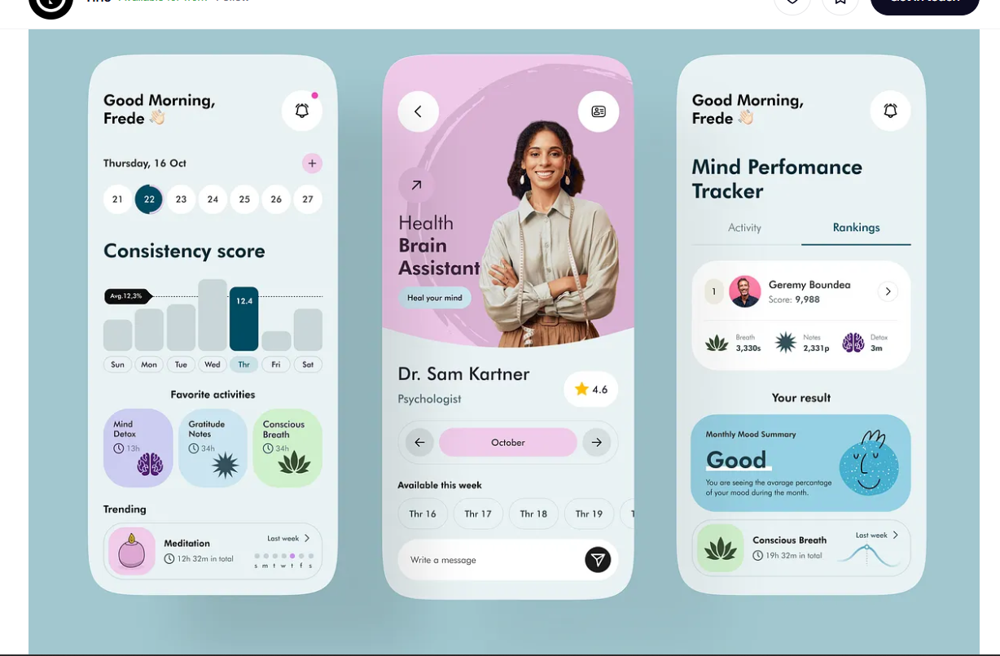
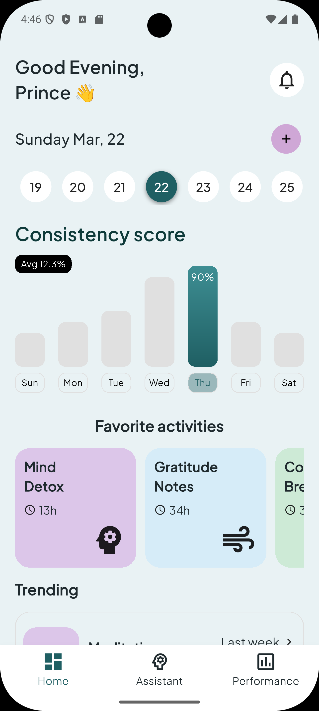
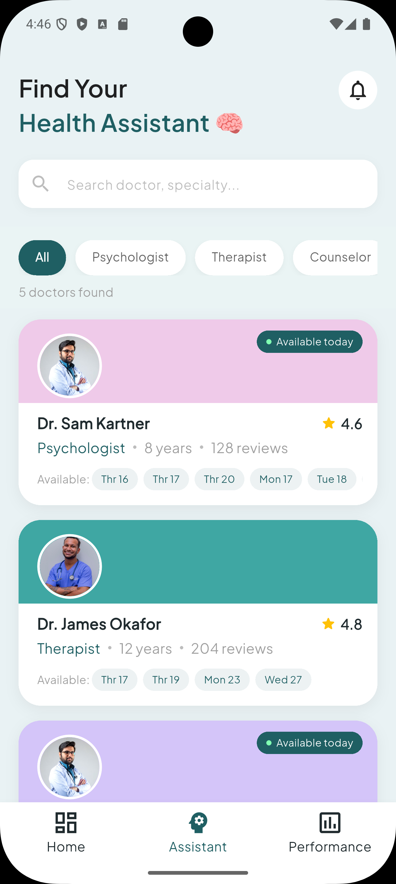
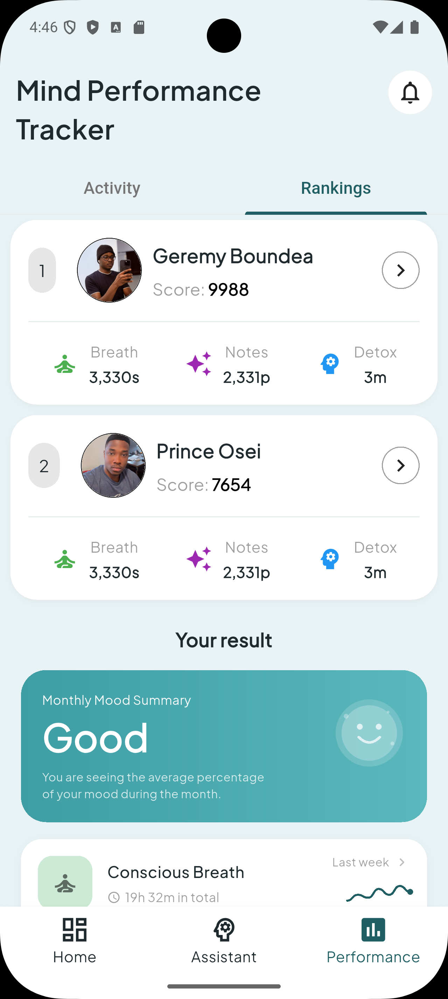

# 🧠 Mental Health UI - Flutter

<p align="center">
   
</p>

A clean Flutter implementation of a modern Mental Health mobile app UI inspired
by Dribbble.

This project was built as part of my journey back into mobile development —
focusing on UI design, layout structure, and Flutter best practices.

---

## ✨ Features

- 📱 Clean and modern UI design
- 🧩 Reusable Flutter widgets
- 📊 Consistency tracking UI
- 🧠 Therapist/Assistant interface
- 📈 Performance & ranking screens

---

## 📱 Screenshots

<p align="center">
  
  
  
</p>

---

## 🛠️ Built With

- Flutter
- Dart

---

## 🎯 What I Learned

- Structuring Flutter UI for scalability
- Handling layout and responsiveness
- Converting design (Dribbble) → real app
- Improving UI consistency and spacing

---

## 🚀 Getting Started

```bash
git clone https://github.com/Prince-Ampomah/mental_health_ui
cd mental_health_ui
flutter pub get
flutter run
```
